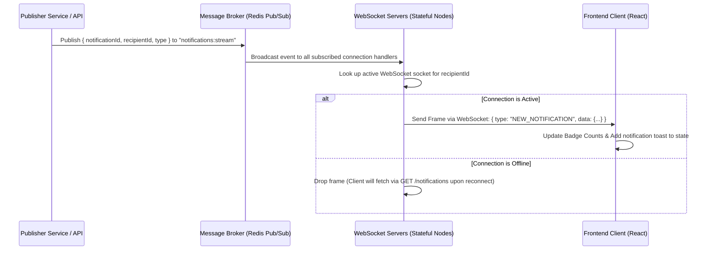
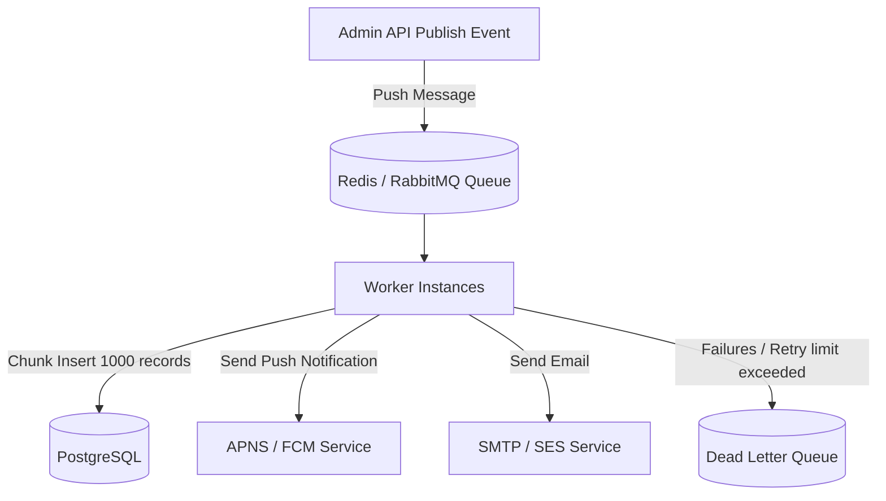

# Notification Management System - Architecture & Design Document

This document covers the complete system architecture, database design, performance optimizations, and algorithmic engines for the Notification Management System.

---

## Stage 1: Notification APIs & Real-Time Architecture

### 1. HTTP API Specifications

#### `GET /api/notifications`
Fetches a paginated list of notifications, optionally filtered by type.
* **Headers**:
  ```http
  Authorization: Bearer <access_token>
  Accept: application/json
  ```
* **Query Parameters**:
  * `page` (integer, default: `1`): The current page number.
  * `limit` (integer, default: `10`): Number of notifications per page.
  * `notification_type` (string, optional): Filter by `Event`, `Result`, or `Placement`.
  * `search` (string, optional): Filter by title/message keyword.
* **Response Codes**:
  * `200 OK`: Request succeeded.
  * `401 Unauthorized`: Invalid or missing authentication token.
  * `500 Internal Server Error`: Backend error.
* **Response Body**:
  ```json
  {
    "success": true,
    "data": {
      "notifications": [
        {
          "id": "e4b958fb-7cfd-4a1e-8e8e-cbf7384a22db",
          "title": "New Placement Drive",
          "message": "Google is visiting the campus for Software Engineering roles.",
          "type": "Placement",
          "isRead": false,
          "createdAt": "2026-06-17T11:13:42.000Z"
        }
      ],
      "pagination": {
        "total": 45,
        "page": 1,
        "limit": 10,
        "totalPages": 5
      }
    }
  }
  ```

#### `POST /api/notifications/:id/read`
Marks a specific notification as read.
* **Headers**:
  ```http
  Authorization: Bearer <access_token>
  ```
* **Response Codes**:
  * `200 OK`: Marked as read.
  * `404 Not Found`: Notification not found.
  * `401 Unauthorized`: Authentication failed.
* **Response Body**:
  ```json
  {
    "success": true,
    "message": "Notification marked as read.",
    "data": {
      "id": "e4b958fb-7cfd-4a1e-8e8e-cbf7384a22db",
      "isRead": true,
      "readAt": "2026-06-17T11:20:00.000Z"
    }
  }
  ```

#### `POST /api/notifications/:id/unread`
Marks a specific notification as unread.
* **Headers**:
  ```http
  Authorization: Bearer <access_token>
  ```
* **Response Codes**:
  * `200 OK`: Marked as unread.
* **Response Body**:
  ```json
  {
    "success": true,
    "message": "Notification marked as unread."
  }
  ```

#### `GET /api/notifications/priority`
Retrieves the top 10 notifications calculated by the priority heap engine.
* **Headers**:
  ```http
  Authorization: Bearer <access_token>
  ```
* **Response Body**:
  ```json
  {
    "success": true,
    "data": [
      {
        "id": "a1b2c3d4-e5f6-7a8b-9c0d-e1f2a3b4c5d6",
        "title": "Microsoft Interview Shortlist",
        "message": "You have been shortlisted for the final interview rounds.",
        "type": "Placement",
        "priority": 3,
        "isRead": false,
        "createdAt": "2026-06-17T11:15:00.000Z"
      }
    ]
  }
  ```

### 2. JSON Schema (Notification Instance)

```json
{
  "$schema": "http://json-schema.org/draft-07/schema#",
  "title": "Notification",
  "type": "object",
  "properties": {
    "id": {
      "type": "string",
      "format": "uuid"
    },
    "title": {
      "type": "string",
      "minLength": 1,
      "maxLength": 255
    },
    "message": {
      "type": "string"
    },
    "type": {
      "type": "string",
      "enum": ["Event", "Result", "Placement"]
    },
    "priority": {
      "type": "integer",
      "minimum": 1,
      "maximum": 3
    },
    "isRead": {
      "type": "boolean"
    },
    "createdAt": {
      "type": "string",
      "format": "date-time"
    }
  },
  "required": ["id", "title", "message", "type", "priority", "isRead", "createdAt"]
}
```

### 3. Real-Time Architecture & Event Flow

To scale notifications to millions of concurrent users, a push-based model using WebSockets (or Server-Sent Events) is employed, integrated with a Pub/Sub message broker (Redis/RabbitMQ).



---

## Stage 2: Database Architecture (PostgreSQL)

### 1. Relational Schema Design

```sql
-- 1. Users Table
CREATE TABLE users (
    id UUID PRIMARY KEY DEFAULT gen_random_uuid(),
    email VARCHAR(255) UNIQUE NOT NULL,
    name VARCHAR(255) NOT NULL,
    created_at TIMESTAMP WITH TIME ZONE DEFAULT CURRENT_TIMESTAMP NOT NULL
);

-- 2. Notifications Table (Stores the notification payload)
CREATE TABLE notifications (
    id UUID PRIMARY KEY DEFAULT gen_random_uuid(),
    title VARCHAR(255) NOT NULL,
    message TEXT NOT NULL,
    type VARCHAR(50) NOT NULL CHECK (type IN ('Event', 'Result', 'Placement')),
    priority SMALLINT NOT NULL CHECK (priority IN (1, 2, 3)),
    created_at TIMESTAMP WITH TIME ZONE DEFAULT CURRENT_TIMESTAMP NOT NULL
);

-- 3. Notification Reads Table (Tracks read state per student/user)
CREATE TABLE notification_reads (
    user_id UUID NOT NULL REFERENCES users(id) ON DELETE CASCADE,
    notification_id UUID NOT NULL REFERENCES notifications(id) ON DELETE CASCADE,
    is_read BOOLEAN DEFAULT FALSE NOT NULL,
    read_at TIMESTAMP WITH TIME ZONE,
    PRIMARY KEY (user_id, notification_id)
);
```

### 2. Architectural Decisions

#### Why PostgreSQL?
* **ACID Compliance**: Ensuring notification status updates (e.g. read status) are transactional and consistent.
* **Advanced Query Planner**: PostgreSQL's planner handles complex indexing (partial indexes, multi-column indexes) efficiently.
* **JSONB Support**: Allows storage of flexible metadata payloads directly alongside structured rows.
* **Concurrency**: Features Multi-Version Concurrency Control (MVCC), which supports high read-write ratios.

#### Partitioning Strategy
For tables scale-up (e.g. over 100M+ notifications), the `notifications` table can be partitioned by range based on the `created_at` timestamp (e.g., monthly partitions).
* **Rationale**: Older notifications are rarely queried. Storing them in separate partitions reduces index sizes for active partitions and simplifies data retention (e.g., dropping partitions older than 1 year takes milliseconds and does not trigger heavy delete locks).

#### Scaling Strategy
* **Read Replicas**: Use a single primary instance for writes (creation of notifications, markings read) and horizontal read replicas for fetching notifications.
* **Connection Pooling**: Use PgBouncer to manage database connection overhead under high traffic.

#### Indexing Strategy
* Primary keys are indexed automatically using B-Trees.
* Create a composite index on `notification_reads(user_id, is_read, notification_id)` to optimize inbox fetches.
* Create a partial index for unread notifications to keep the index size minimal.

---

## Stage 3: Query Optimization Analysis

### 1. Slow Query Analysis

```sql
SELECT *
FROM notifications
WHERE studentID = 1042
AND isRead = false
ORDER BY createdAt ASC;
```

#### Why is this query slow?
1. **Lack of Index (Sequential Scan)**: If no index covers `studentID`, PostgreSQL executes a sequential scan over the entire table, loading all blocks into memory to filter matching rows.
2. **Double Index Lookup Overhead**: If there are separate indexes on `studentID` and `isRead`, PostgreSQL performs a **Bitmap Index Scan** on both, combines them using a bitmap AND, and then reads the Heap table pages. This is inefficient compared to a single pre-ordered composite search.
3. **Sort Overhead**: The `ORDER BY createdAt ASC` requires PostgreSQL to sort the matched subset in memory (Quick Sort) or on disk (Merge Sort) if the data is larger than `work_mem`.
4. **`SELECT *` Waste**: Fetches unnecessary large columns (like the message body text), which increases memory usage and disk read I/O (loading TOAST tables).

### 2. Optimized Query

```sql
SELECT id, title, type, priority, created_at
FROM notifications
WHERE student_id = 1042
  AND is_read = FALSE
ORDER BY created_at ASC;
```

### 3. Complexity Analysis & Recommended Indexes

#### Composite Index Recommendation
```sql
CREATE INDEX idx_notifications_student_unread_created
ON notifications (student_id, is_read, created_at);
```

#### Plan Comparison & Time Complexity
* **Before Indexing**:
  * Time Complexity: **$O(N)$** where $N$ is the total number of rows in the table (due to Sequential Scan + Sorting).
  * Execution Plan: `Seq Scan -> Sort -> Limit`
* **After Indexing**:
  * Time Complexity: **$O(\log N + K)$** where $K$ is the number of matching unread notifications.
  * Execution Plan: `Index Scan using idx_notifications_student_unread_created`
  * No explicit sort is executed; the B-Tree index structure pre-arranges nodes in sorted order.

---

## Stage 4: Performance & Optimization Strategies

| Strategy | Description & Implementation Details |
| :--- | :--- |
| **Pagination** | Implement Keyset Pagination (Cursor-based) instead of Offset pagination (`LIMIT/OFFSET`) for large datasets. Offset requires scanning and discarding pages, which incurs $O(N)$ lookup costs. |
| **Caching** | Cache unread notifications count in Redis. Invalidate the cache when a new notification is posted or marked read. |
| **Lazy Loading / Infinite Scroll** | In the client, load the first 15 records. When the user scrolls near the bottom of the container, trigger a fetch for the next page utilizing a cursor timestamp. |
| **Database Indexing** | Create indexes strategically. Use composite indexes for filtered and ordered queries, and partial indexes (e.g. `WHERE is_read = false`) to keep active index footprints small. |
| **Query Optimization** | Query only required columns instead of using `SELECT *`. Avoid wildcard search prefixes (e.g., `LIKE '%keyword%'`) which bypass B-Tree indexes; use `tsvector` and full-text search indexing instead. |
| **API Response Compression** | Use `gzip` or `brotli` compression middleware in the Express backend to compress HTTP responses before transmission. |

---

## Stage 5: Notify All Process (Scale-out Redesign)

When publishing a notification to all users (e.g., 500,000 students), performing this synchronously will cause HTTP timeouts and database locks. We redesign this using an asynchronous queue system.



### Queue Mechanics
1. **Producer**: The API request inserts a single metadata record representing the campaign, and pushes a task `{ campaignId: "uuid", payload: {...} }` into the broker.
2. **Worker Chunking**: Worker instances pull tasks. Instead of inserting user rows one-by-one, they fetch user ID groups (e.g., 1,000 at a time) and perform **bulk inserts**:
   ```sql
   INSERT INTO notification_reads (user_id, notification_id, is_read)
   VALUES (user1, notif_id, false), (user2, notif_id, false)...
   ON CONFLICT DO NOTHING;
   ```
3. **Dead Letter Queue (DLQ)**: If push notification or email gateways fail, the task is retried up to 3 times with exponential backoff. Upon continuous failure, the item is pushed to a Dead Letter Queue (DLQ) for debugging and alert triggers.

---

## Stage 6: Priority Notification Engine

The system uses a **Priority Queue** implemented as a **Max-Heap** to identify the most relevant notifications without querying the database for sorting.

### 1. Priority Rules
* **Placement** notifications have the highest priority: Weight = **3**
* **Result** notifications have medium priority: Weight = **2**
* **Event** notifications have the lowest priority: Weight = **1**
* **Time TIE-BREAKER**: If priorities are equal, the latest notification (higher timestamp/newer) wins.

### 2. Time Complexity Analysis

Let $N$ be the number of incoming notifications and $K$ be the limit of top notifications we want to maintain (here, $K = 10$).

* **Algorithm**: Maintain a Min-Heap of size $K$. For each incoming notification, if the heap is not full, push it. If full, compare it with the minimum element in the heap. If the new notification is greater, extract the minimum and push the new one.
* **Time Complexity**:
  * Pushing an element: **$O(\log K)$**
  * Processing $N$ stream elements: **$O(N \log K)$**
  * Space Complexity: **$O(K)$** (extremely light memory footprint).

### 3. TypeScript Engine Code Implementation

```typescript
export interface Notification {
  id: string;
  title: string;
  message: string;
  type: 'Event' | 'Result' | 'Placement';
  priority: 1 | 2 | 3; // Event=1, Result=2, Placement=3
  createdAt: Date;
}

// Compare two notifications A and B based on priority first, then createdAt date
export function compareNotifications(a: Notification, b: Notification): number {
  if (a.priority !== b.priority) {
    return a.priority - b.priority;
  }
  return new Date(a.createdAt).getTime() - new Date(b.createdAt).getTime();
}

export function getTopNotifications(notifications: Notification[], limit: number = 10): Notification[] {
  // Heap representation or sorting can be used. For an array in-memory:
  return [...notifications]
    .sort((a, b) => compareNotifications(b, a)) // sort descending
    .slice(0, limit);
}
```

---

## Stage 7: Screenshots Placeholder

*Below are placeholders for the UI implementation screenshots.*

#### Dashboard Interface


#### Notifications Listing


#### Priority Notifications

